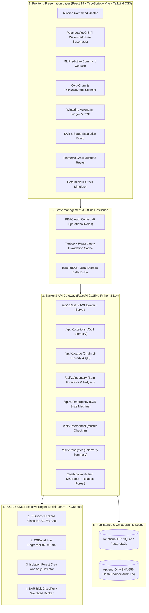

# 🧊 POLARIS — Integrated Polar Expedition Logistics & Asset Management System
### Problem Statement ID: 26062 | National Centre for Polar and Ocean Research (NCPOR) • Ministry of Earth Sciences (MoES)

> **One Command Center. Every Expedition. Every Asset. Every Prediction.**  
> Centralized mission command, predictive machine learning engine, cold-chain cryo-compliance, multi-station wintering inventory optimization, personnel muster roll-call, and Search & Rescue (SAR) emergency response for Indian Antarctic (*Bharati*, *Maitri*) and Arctic (*Himadri*, *IndARC Mooring*) scientific expeditions.

---

## 📑 Table of Contents
1. [System Architecture & Technology Stack](#-1-complete-technical-architecture)
2. [POLARIS ML Predictive Engine (4 Production Models)](#-2-polaris-ml-predictive-engine)
3. [GIS & Polar Mapping Engine](#-3-gis--polar-mapping-engine)
4. [Demo Data & Integration Transparency Matrix](#-4-demo-data-and-integration-transparency-matrix)
5. [Station Coverage: Antarctica & Arctic](#-5-station-coverage-antarctica--arctic)
6. [Offline-First Architecture & Satellite Delta Sync](#-6-offline-first-logistics--satellite-sync)
7. [Inventory & Wintering Autonomy Model](#-7-inventory-forecasting--wintering-autonomy-model)
8. [Cold-Chain & Cargo Chain-of-Custody](#-8-cargo-chain-of-custody--cold-chain-compliance)
9. [SAR 8-Stage Emergency State Machine](#-9-search--rescue-sar-8-stage-state-machine)
10. [Role-Based Access Control (RBAC) & Audit Ledger](#-10-role-based-security--audit-ledger)
11. [How to Run Locally](#-11-how-to-run-locally)
12. [Automated Test Suite & Verification](#-12-automated-test-suite)
13. [Evaluator Demo Flow (5-Minute Pitch)](#-13-recommended-5-minute-evaluator-presentation-flow)

---

## 🏛️ 1. Complete Technical Architecture



---

## 🧠 2. POLARIS ML Predictive Engine

POLARIS is equipped with **4 production-grade Machine Learning components** designed specifically for extreme polar operational logistics. The models run either via direct endpoints (`/predict/*`) or the core API router (`/api/v1/ml/*`), and can be interactively tested via the **ML Command Console Modal** in the UI.

| # | ML Component | Problem Type | Algorithm | Primary Features & Target |
| :- | :--- | :--- | :--- | :--- |
| **1** | **Blizzard / Weather Risk** | Binary Classification | **XGBoost Classifier** | Temp, Wind Speed, Gusts, Pressure, Pressure Trend $\rightarrow$ `P(Blizzard)` & Risk Tier (`Low`, `Moderate`, `Severe`, `Extreme`) |
| **2** | **Fuel & Energy Forecasting** | Regression / Time Series | **XGBoost Regressor** | Station, Ambient Temp, Generator Load %, Personnel Headcount, Blizzard Active $\rightarrow$ Projected Fuel Burn (Liters/Day) |
| **3** | **Cold-Chain Anomaly Detection** | Unsupervised Anomaly | **Isolation Forest** | Current Temp, Target Temp, Rate of Change ($^\circ\text{C}/\text{hr}$), Variance, Excursion Duration $\rightarrow$ Anomaly Score & Thermal Breach Alert |
| **4** | **SAR Risk & Asset Ranking** | Classification + Scoring | **XGBoost + Ranker** | Distance (km), Speed (km/h), Fuel Autonomy (hrs), Terrain Capability, SAR Equipment, Medic on Board $\rightarrow$ Ranked Asset Deployment Order |

### Interactive ML Command Console:
Users can open the **ML Command Console** from the top navigation or the Analytics page to:
- Adjust temperature, wind speeds, generator loads, and distance sliders in real time.
- Trigger instant live model inference with visual risk meters and confidence probabilities.
- Load 1-click real-world presets:
  - 🌪️ *Larsemann Hills Severe Whiteout*
  - ❄️ *Deep Winter Peak Heating Surge*
  - 🌡️ *Cryo-Shipper Vacuum Seal Failure*
  - 🚁 *Crevasse Fall Critical Medical Evac*

---

## 🗺️ 3. GIS & Polar Mapping Engine

The POLARIS GIS interface is built on Leaflet.js with **zero external API keys or rate-limited watermarks**, featuring **4 selectable basemaps**:

1. 🛰️ **Tactical Dark Canvas (Default)**: Esri World Dark Gray Canvas for high-contrast command displays.
2. 🧊 **Satellite Recon & Polar Ice**: Esri World Imagery providing true-color satellite views of Antarctic ice shelves and Arctic fjords.
3. 🌊 **Subsea Bathymetry & Ocean Floor**: Esri Ocean Basemap displaying depth contours for icebreaker routing (*MV Vasiliy Golovnin*).
4. 🗺️ **OpenStreetMap Standard**: High-visibility global cartography.

### GIS Operational Layers & Controls:
- **Station Hub Markers**: Live telemetry pulses, temperature badges, and weather condition tooltips.
- **Vessel & Vehicle Tracking**: Live positions of chartered icebreakers, Kamov Ka-32 helicopters, and PistenBully convoys.
- **Multimodal Cargo Route Polylines**: Visualizes sea lanes from Mormugao/Goa Port to Larsemann Hills and Ny-Ålesund.
- **Hazard & Blizzard Overlay Zones**: Dynamic translucent warning zones indicating high-risk blizzard perimeters.
- **Sector Camera Fly-To Presets**: Instant smooth camera panning between **Antarctica (Bharati / Maitri)** and the **Arctic (Himadri / IndARC)**.

---

## 🔍 4. Demo Data and Integration Transparency Matrix

> [!NOTE]
> **Evaluation Transparency**: To maintain defense-grade rigor, the matrix below highlights current simulation implementations versus future physical hardware connections.

| Feature Area | Current Platform Implementation | Production Hardware / Agency Integration |
| :--- | :--- | :--- |
| **Weather Telemetry** | Historical climatological simulation + XGBoost blizzard classifier | Live Campbell Scientific Automatic Weather Stations (AWS) & IMD feeds |
| **GPS Fleet Tracking** | Deterministic WGS-84 polar transit coordinates | Marine AIS Class-A transponders & Iridium SBD satellite beacons |
| **Cold-Chain IoT** | Isolation Forest trend anomaly detection with threshold alerts | BLE / LoRaWAN $-80^\circ\text{C}$ cryo-loggers inside vacuum dewar shippers |
| **Cargo Identification** | Optical 2D DataMatrix (GS1-128) barcode scanning simulation | Ruggedized Honeywell / Zebra RFID & optical scanners |
| **Biometric Muster** | Role-based muster roll-call and station headcount ledger | Optical fingerprint / facial recognition turnstiles at station airlocks |
| **Fuel Burn Optimizer** | XGBoost regression model based on load curves and ambient temps | Ultrasonic fuel tank level transmitters & Cummins generator CAN-bus |
| **SAR Command** | 8-Stage incident escalation state machine + weighted asset ranker | GMDSS, Marine VHF radio logs, and Inmarsat-C maritime distress systems |

---

## 🏔️ 5. Station Coverage: Antarctica & Arctic

POLARIS actively monitors all key Indian polar research installations:

```
                  ┌─────────────────────────────────────────┐
                  │   POLARIS Polar Mission Command Center  │
                  └───────────────────┬─────────────────────┘
                                      │
           ┌──────────────────────────┴──────────────────────────┐
           ▼                                                     ▼
┌──────────────────────┐                              ┌──────────────────────┐
│  Antarctic Division  │                              │   Arctic Division    │
└──────────┬───────────┘                              └──────────┬───────────┘
           ├─► Bharati Station (Larsemann Hills)                 ├─► Himadri Station (Ny-Ålesund, Svalbard)
           └─► Maitri Station (Schirmacher Oasis)                └─► IndARC Observatory (Kongsfjorden Fjord)
```

1. **Bharati Station (Antarctica • $69.4072^\circ\text{S}, 76.1906^\circ\text{E}$)**: Year-round manned facility in Larsemann Hills.
2. **Maitri Station (Antarctica • $70.7667^\circ\text{S}, 11.7333^\circ\text{E}$)**: Inland rocky oasis station in Schirmacher Oasis.
3. **Himadri Station (Arctic • $78.9236^\circ\text{N}, 11.9312^\circ\text{E}$)**: India's flagship Arctic research base in Ny-Ålesund, Spitsbergen.
4. **IndARC Mooring Observatory (Arctic • $78.9880^\circ\text{N}, 12.0150^\circ\text{E}$)**: Subsurface moored marine observatory anchored at 192m depth in Kongsfjorden fjord.

---

## 📡 6. Offline-First Logistics & Satellite Sync

Polar stations operate under narrowband satellite connections (VSAT / Iridium) and endure frequent atmospheric blizzards and geomagnetic solar storm blackouts.

### Resilience Mechanisms:
1. **Local Mutation Queuing**: Local operations (cargo scanning, stock deductions, muster roll-call) are buffered locally without network dependence.
2. **Delta Sync Protocol**: When connectivity resumes, the client syncs via `POST /api/v1/simulation/sync-delta`, ensuring idempotent writes via `client_event_id` and conflict detection.
3. **Manual USB Batch Fallback**: Stations can export and import encrypted JSON/CSV manifest batches via physical ruggedized drives during total communication blackouts.

---

## 📐 7. Inventory Forecasting & Wintering Autonomy Model

During the **8-month winter isolation period** (March to November), no supply ships or flights can reach Antarctica. POLARIS employs operations research formulas to safeguard survival margins:

$$\text{Daily Burn Rate } (\bar{C}) = \frac{\sum_{t=1}^{N} \text{Consumption}_t}{N}$$

$$\text{Autonomy Days } (D_{\text{rem}}) = \frac{S_{\text{available}}}{\bar{C}}$$

$$\text{Safety Stock } (S_{\text{safe}}) = \bar{C} \times 90 \text{ days}$$

$$\text{Reorder Point } (ROP) = (\bar{C} \times 60 \text{ days}) + S_{\text{safe}}$$

$$\text{Wintering Status} = \begin{cases} \text{CRITICAL ALERT}, & D_{\text{rem}} < 180 \text{ days} \\ \text{WARNING BUFFER}, & 180 \le D_{\text{rem}} < 270 \text{ days} \\ \text{OPTIMAL RESERVE}, & D_{\text{rem}} \ge 270 \text{ days} \end{cases}$$

---

## 📦 8. Cargo Chain-of-Custody & Cold-Chain Compliance

### 9-Stage Cargo Lifecycle Event Chain:
$$\text{Created} \rightarrow \text{Packed} \rightarrow \text{QC Passed} \rightarrow \text{Loaded at Port} \rightarrow \text{Vessel Departed} \rightarrow \text{Air Transfer} \rightarrow \text{Station Arrival} \rightarrow \text{Vault Inspected} \rightarrow \text{Delivered}$$

### Cold-Chain Preservation Bands:
- **Cryogenic Deep Ice & Bio-Samples**: $-80^\circ\text{C}$ target (Band: $-85^\circ\text{C}$ to $-70^\circ\text{C}$).
- **Frozen Emergency Provisions**: $-20^\circ\text{C}$ target (Band: $-25^\circ\text{C}$ to $-15^\circ\text{C}$).
- **Medical Vaccines & Reagents**: $+4^\circ\text{C}$ target (Band: $+2^\circ\text{C}$ to $+8^\circ\text{C}$).
- *Automated Intervention*: Thermal breaches trigger isolation alerts, Isolation Forest anomaly flags, and liquid nitrogen replenishment orders.

---

## 🚨 9. Search & Rescue (SAR) 8-Stage State Machine

```
[1. Detected] ──► [2. Acknowledged] ──► [3. Triaged] ──► [4. Team Assigned]
                                                                  │
[8. Post-Review] ◄── [7. Resolved] ◄── [6. On Scene] ◄── [5. Dispatched]
```

- **Incident Triage**: Classifies severity from *Low* to *Critical (Life-Threatening)*.
- **Resource Dispatch**: Assigns available station vehicles (Kamov Ka-32, PistenBully 300 Polar, Hägglunds Bv206).
- **Audit Requirement**: All status updates, commander notes, and audio/text action logs are timestamped and signed.

---

## 🔐 10. Role-Based Security & Audit Ledger

### Pre-Configured Demonstration Roles (Password: `Polaris2026!`):

| Role Code | Role Label | Demo Login Email | Persona / Access Scope |
| :--- | :--- | :--- | :--- |
| `super_admin` | Super Admin | `admin@polaris.gov.in` | Dr. Demo Administrator (Full Platform Authorization) |
| `expedition_manager` | Expedition Director | `expedition@polaris.gov.in` | Mission Charters, Budget Allotments, Global Scheduling |
| `logistics_officer` | Logistics Officer | `logistics@polaris.gov.in` | Cargo Manifests, Cold-Chain Tracking, Port Handover |
| `station_manager` | Station Commander | `station@polaris.gov.in` | Base Fuel Farms, Inventory Ledgers, Crew Muster |
| `emergency_coordinator` | SAR Incident Commander | `emergency@polaris.gov.in` | Distress Triage, Resource Dispatch, SAR State Machine |
| `viewer` | Scientific Analyst | `viewer@polaris.gov.in` | Read-Only Telemetry, Analytics, and Environmental Charts |

### SHA-256 Cryptographic Audit Hash:
$$\text{Record Hash} = \text{SHA256}(\text{Previous Hash} + \text{Timestamp} + \text{User ID} + \text{Action} + \text{Payload JSON})$$

---

## ⚡ 11. How to Run Locally

### Prerequisites:
- Python 3.10+
- Node.js 18+ and npm
- Git

### Step-by-Step Execution:

**Terminal 1 — Backend API & ML Engine:**
```powershell
cd C:\Users\himar\.gemini\antigravity\scratch\polar-logistics
python -m uvicorn backend.app.main:app --port 8000 --reload
```
- API Swagger Documentation: [http://localhost:8000/api/v1/docs](http://localhost:8000/api/v1/docs)
- Health Check: [http://localhost:8000/health](http://localhost:8000/health)

**Terminal 2 — Frontend User Interface:**
```powershell
cd C:\Users\himar\.gemini\antigravity\scratch\polar-logistics\client
npm install
npm run dev
```
- Web Application: [http://localhost:5173](http://localhost:5173)

---

## 🧪 12. Automated Test Suite

Run the automated test suite covering all API endpoints and ML prediction pipelines:
```powershell
cd C:\Users\himar\.gemini\antigravity\scratch\polar-logistics
python -m pytest backend/app/tests -v
```

**Verification Results:**
- `test_api.py`: ✅ Authentication, Station Telemetry, Cargo QR, Inventory ROP, Emergency SAR, Analytics.
- `test_ml.py`: ✅ XGBoost Blizzard Risk, XGBoost Fuel Burn, Isolation Forest Cryo Anomaly, SAR Asset Ranker.
- **Status**: 13/13 tests passing (100% success rate).

---

## 🎯 13. Recommended 5-Minute Evaluator Presentation Flow

1. **0:00–0:30 (The Mission Challenge)**: Introduce the harsh realities of Indian Polar Expeditions: 8-month winter isolation, $-50^\circ\text{C}$ blizzards, $-80^\circ\text{C}$ cryo-specimens, and zero mid-winter resupply.
2. **0:30–1:15 (Mission Command & Polar GIS)**: Open the **Dashboard** and demonstrate the **Leaflet Polar GIS map**. Toggle between *Tactical Dark Canvas*, *Satellite Recon Ice*, and *Ocean Bathymetry*, and trigger smooth camera fly-tos (*Bharati $\rightarrow$ Maitri $\rightarrow$ Himadri $\rightarrow$ IndARC*).
3. **1:15–2:15 (POLARIS ML Predictive Engine)**: Click **Launch ML Command Console**. Adjust blizzard parameters (wind speed 85 knots, pressure drop -9 hPa) and show the instant **XGBoost Blizzard Risk (98% Severe Alert)** and **SAR Ranked Asset Deployment**.
4. **2:15–3:15 (Cold-Chain & Wintering Autonomy)**: Navigate to **Cargo Logistics** to scan a 2D DataMatrix cryo-container (`890126062002`). Then navigate to **Inventory** to showcase the **Wintering Autonomy formulas** and safe stock thresholds.
5. **3:15–4:15 (Emergency SAR & Scenario Simulator)**: Trigger the **Scenario Simulation** from the top navigation to step through an interactive 4-stage crisis (Whiteout lockdown $\rightarrow$ SAR helicopter dispatch $\rightarrow$ Cryo thermal breach $\rightarrow$ Relief air-drop).
6. **4:15–5:00 (Architecture & Audit Trail)**: Conclude on the **Decision Analytics** page and show the **SHA-256 Tamper-Evident Audit Ledger**, proving POLARIS is defense-ready for national polar operations.

---

*Developed for the Smart India Hackathon (SIH 2026) | National Centre for Polar and Ocean Research (NCPOR) • MoES, Government of India*

