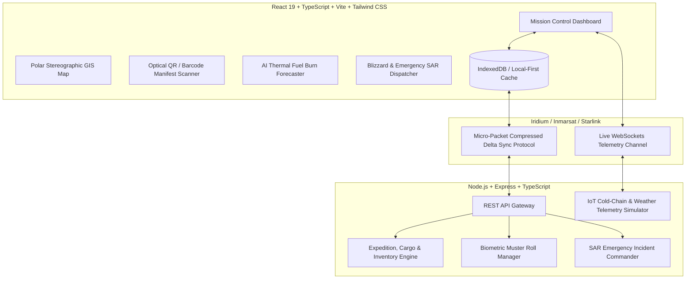

# POLARIS 🧊 | Integrated Polar Expedition Logistics & Asset Management System
### National Centre for Polar and Ocean Research (NCPOR) • Ministry of Earth Sciences (MoES)
**Smart India Hackathon 2026 — Problem Statement ID: 26062**

---

## 🌟 Executive Summary
**POLARIS** is a mission-critical, centralized digital operations and logistics platform engineered specifically for the extreme challenges of Indian Antarctic (*Maitri*, *Bharati*), Arctic (*Himadri*, *IndARC*), Himalayan (*Himansh*), and Southern Ocean research expeditions (*ORV Sagar Kanya*, *MV Vasiliy Golovnin*).

Polar research bases operate in some of the most isolated and hostile environments on Earth, where stations endure up to **9 months of complete winter isolation**, temperatures plunging below $-55^\circ\text{C}$, katabatic wind gusts over $120\text{ km/h}$, and severely constrained satellite bandwidth.

POLARIS solves these logistical lifelines with:
1. **Satellite-Optimized Offline-First Protocol**: Automatic local caching in browser storage / IndexedDB with micro-packet delta sync for narrowband $9.6\text{ kbps}$ satellite links (Iridium Certus, Inmarsat FleetBroadband, and Polar Starlink).
2. **Polar Stereographic Geospatial Operations Center**: Real-time tracking of research stations, chartered icebreakers, polar helicopters, and field traverses across Antarctic and Arctic coordinate projections.
3. **IoT Cold-Chain & Hazmat Asset Management**: Live sensor monitoring for $-80^\circ\text{C}$ biological cryo-samples, ice core paleoclimate samples, and optical RFID/2D barcode scanners.
4. **AI Thermal & Fuel Burn Autonomy Forecaster**: Predictive modeling calculating daily Polar Diesel (D-10) and Jet A-1 burn rates against ambient winter temperatures, blizzard frequency, and generator load to prevent mid-winter fuel depletion.
5. **Extreme Blizzard & Search and Rescue (SAR) Incident Commander**: Instant Stage-1/2/3 whiteout lockdown broadcast, outdoor sortie recall, and biometric headcount muster roll.

---

## 🏗️ System Architecture



---

## 🚀 Key Modules & Capabilities

### 1. 🌐 Centralized Expedition Planning & Lifecycle
- Multi-station expedition chartering (*ISEA-44*, *Arctic Spring Campaign*).
- Budget utilization tracking (in ₹ Crores), multimodal cargo quota allocations, and milestone management.
- Dynamic scientific deliverable tracking and objective verification checklists.

### 2. 📦 Cargo & Cold-Chain IoT Asset Tracking
- Complete digital manifests for containers, scientific instruments, and hazardous materials.
- Real-time IoT temperature monitoring with automated threshold violation alerts for biological samples stored at $-80^\circ\text{C}$.
- Built-in optical QR/Barcode scanner simulator supporting instant cargo staging updates (*Port* $\rightarrow$ *Vessel Hold* $\rightarrow$ *Helicopter Airlift* $\rightarrow$ *Station Vault*).

### 3. ⛽ Multi-Station Polar Inventory & AI Fuel Burn Predictor
- Continuous monitoring of Polar Low Pour Point Diesel (D-10) and Aviation Turbine Fuel (Jet A-1).
- High-calorie freeze-dried survival ration (MRE) buffers and critical Cummins generator spare parts.
- Interactive AI Thermal Simulator calculating daily burn acceleration linked to cold degree days and katabatic wind storms.

### 4. 🧑‍🚀 Personnel Movement, Health Records & Biometric Muster
- Expedition crew manifests with blood groups, organization affiliations (NCPOR, IMD, Navy, AIIMS), and tactical radio frequencies.
- Class-1 Polar Medical fitness certification status and extreme cold survival training records.
- Emergency Biometric Muster Roll check-in system for instant station headcount during whiteout emergencies.

### 5. 🚨 Search and Rescue (SAR) & Blizzard Incident Commander
- Live meteorological feeds with dynamic wind chill calculations.
- One-touch Stage-3 Whiteout Lockdown triggering audible alarms and broadcast notifications to all polar bases and ships.
- Search and Rescue (SAR) mission logger with chronological action timeline and unit dispatch coordination.

---

## 💻 Tech Stack

| Layer | Technology |
|---|---|
| **Frontend UI** | React 19, TypeScript, Vite, Tailwind CSS, Lucide Icons, Recharts |
| **Geospatial Engine** | Polar Stereographic SVG/Canvas Map, Custom Lat/Lng Cartography |
| **Backend & APIs** | Node.js, Express, TypeScript, WebSockets (`ws`) |
| **Data & Sync** | In-Memory Data Store, LocalStorage / IndexedDB Offline Cache, Delta Compression Sync |
| **Simulation** | Real-time IoT Telemetry Generator (Weather, GPS Tracks, Cold-Chain Sensors) |

---

## 🛠️ Quick Start & Running Locally

### 1. Prerequisites
- Node.js v18+ (tested on v24.12.0)
- npm v10+

### 2. Setup & Installation
```bash
# Navigate to the project directory
cd polar-logistics

# Install all dependencies (root, server, and client)
npm run install:all
```

### 3. Run Development Servers
```bash
# Run both Backend API and Frontend simultaneously
npm run dev
```

- **Frontend Application**: `http://localhost:5173`
- **Backend API & WebSockets**: `http://localhost:3001`
- **API Health Endpoint**: `http://localhost:3001/health`

---

## 🏆 Smart India Hackathon Demonstration Highlights

1. **Mission Control Dashboard**: Watch real-time weather fluctuations (ambient temp, wind chill, barometric pressure) streamed every 4 seconds via WebSockets.
2. **Interactive Polar Map**: Switch between **Antarctica (South Pole)** and **Arctic (North Pole)** views to inspect vessel tracks (*MV Vasiliy Golovnin*, *ORV Sagar Kanya*) and active field sorties.
3. **Optical QR Scanner**: Click **QR Scan** in the top bar, pick any sample manifest barcode (e.g., `890126062002`), inspect core $-80^\circ\text{C}$ temperature logs, and log status transfers.
4. **AI Fuel Forecaster**: Open the **AI Fuel Forecaster**, drag the winter temperature slider down to $-50^\circ\text{C}$, and watch dynamic fuel depletion curves recalculate autonomously.
5. **Satellite Offline Simulation**: Flip the **Satellite Link** toggle in the top bar to simulate entering an orbital communication blackout. Perform muster check-ins or cargo scans offline, then view the **Queued Delta Packets** and synchronize seamlessly when the link restores.
6. **Blizzard Mode & SOS**: Click **BLIZZARD SOS**, escalate to **STAGE 3 WHITEOUT LOCKDOWN**, and observe station alerts and SAR deployment protocols.

---
Developed for **NCPOR / MoES — Smart India Hackathon 2026**
