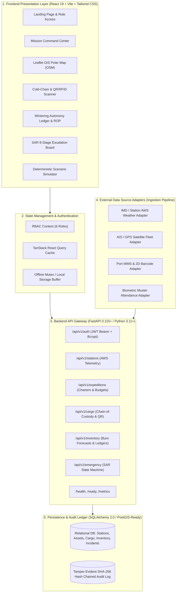

# 🧊 POLARIS — Integrated Polar Expedition Logistics & Asset Management System
### Problem Statement ID: 26062 | National Centre for Polar and Ocean Research (NCPOR) • Ministry of Earth Sciences (MoES)

> **One Command Center. Every Expedition. Every Asset.**
> Operational logistics, cold-chain compliance monitoring, multi-station inventory optimization, crew biometric muster, and Search & Rescue (SAR) emergency incident response for Indian Antarctic (*Bharati*, *Maitri*) and Arctic (*Himadri*, *IndARC*) scientific expeditions.

---

## 🏛️ 1. Complete Technical Architecture & Layer Breakdown



### Layer Descriptions:
1. **Frontend Layer (React 19 + TypeScript + Vite)**: Componentized UI designed with dark-mode polar aesthetics, high contrast readability, responsive layouts, and zero external runtime map dependencies.
2. **Backend/API Layer (FastAPI)**: High-performance asynchronous REST endpoints providing strict Pydantic v2 input validation, structured JSON errors, and OpenAPI 3.1 documentation.
3. **GIS & Mapping Layer**: Leaflet.js with OpenStreetMap standard tiles (`https://{s}.tile.openstreetmap.org/{z}/{x}/{y}.png`), customizable via `VITE_MAP_TILE_URL`, featuring 5 toggleable operational layers and sector camera presets.
4. **Data Adapter Pipeline**: Standardized ingestion framework converting raw external feeds (AWS weather, AIS coordinates, barcode scans) into validated internal database models.
5. **Security & Authorization**: JWT token verification with role-based endpoint guards across 6 operational roles.
6. **Persistence & Tamper-Evident Audit Ledger**: Normalized database schema supporting SQLite and PostgreSQL/PostGIS with append-only SHA-256 hash chaining (`previous_hash` $\rightarrow$ `current_hash`).

---

## 🔍 2. Demo Data and Integration Transparency Matrix

> [!NOTE]
> **Simulation Mode — Demonstration Data Notice**: In compliance with technical evaluation standards, the table below declares what is implemented for the current MVP prototype vs what connects to production hardware in live deployment.

| Feature Area | Current MVP Implementation | Future Production Hardware Integration |
| :--- | :--- | :--- |
| **Weather Telemetry** | Simulated realistic station telemetry based on historical climatology | Live Automatic Weather Stations (AWS) & IMD satellite feeds |
| **GPS Asset Tracking** | Deterministic coordinates along planned polar routes | Marine AIS transponders, Iridium SBD satellite beacons |
| **Cold-Chain IoT** | Dynamic sensor threshold monitoring with simulated thermal breach | BLE / LoRaWAN cryo-loggers inside vacuum-insulated containers |
| **QR & RFID Scanning** | Optical 2D DataMatrix barcode lookup with simulated status transition | Physical ruggedized Honeywell / Zebra RFID & barcode readers |
| **Biometric Muster** | Role-based check-in verification workflow with headcount bar | Hardware optical fingerprint / facial recognition turnstiles |
| **Fuel Burn Optimizer** | Mathematical burn rate model based on generator load curves | Fuel tank ultrasonic depth sensors & Cummins generator CAN-bus |
| **SAR Incidents** | 8-Stage incident escalation state machine with action logs | Official GMDSS, VHF radio links, and Inmarsat-C distress systems |
| **Scenario Simulator** | 4-Stage deterministic crisis simulation walkthrough | High-fidelity physics-based numerical weather & logistics model |

---

## 🛰️ 3. Proposed Data Sources & Adapter Architecture

```
External Feeds (IMD AWS / AIS GPS / Port WMS / RFID Scanners)
                         ↓
             [Data Ingestion Adapter]
                         ↓
               [Pydantic Validation]
                         ↓
       [WGS-84 Coordinate & Unit Normalization]
                         ↓
           [PostgreSQL / PostGIS Database]
                         ↓
      [Command Dashboard • Alerts • GIS Map • Analytics]
```

1. **Weather & Environmental Feeds**:
   - India Meteorological Department (IMD) Antarctic Meteorological Database.
   - On-site Automatic Weather Station (AWS) at Bharati & Maitri (Campbell Scientific dataloggers).
   - Copernicus Marine Environment Monitoring Service (CMEMS) Sea-Ice concentration maps.
2. **Fleet & Vessel Tracking**:
   - Automatic Identification System (AIS) Class-A for chartered icebreaker (*MV Vasiliy Golovnin*).
   - Inmarsat / Iridium Short Burst Data (SBD) transponders on Kamov Ka-32 helicopters and PistenBully convoys.
3. **Warehouse & Cargo Manifests**:
   - NCPOR Mormugao Port staging database (CSV / EDIFACT integration).
   - Optical 2D DataMatrix (GS1-128 standard) container tags.

---

## 📡 4. Offline-First Logistics & Intermittent Satellite Synchronization

Polar research stations face narrowband satellite links (Iridium / VSAT) and frequent solar storm / blizzard communication blackouts.

### Offline Resilience Features:
1. **Local State Buffering**: When the satellite link drops, local mutations (cargo scans, stock deductions, muster check-ins) are buffered in a local queue.
2. **Delta Sync Protocol**: Upon satellite link restoration, the client issues a `POST /api/v1/simulation/sync-delta` transmitting only new mutations with `client_event_id` and `sync_version` to prevent duplicate writes.
3. **Conflict Resolution**: Server-timestamp precedence with operational override authorization.
4. **Manual CSV Fallback**: Support for exporting and importing manifest batches via USB storage drives between field stations.

---

## 📐 5. Inventory Forecasting & Wintering Autonomy Mathematical Model

During the 8-month winter isolation period (March to November), no resupply vessels can penetrate the pack ice. POLARIS calculates wintering safety buffers using standard operations research formulas:

### Mathematical Formulas:

1. **Average Daily Consumption Rate ($\bar{C}$)**:
   $$\bar{C} = \frac{\sum_{t=1}^{N} \text{Consumption}_t}{N}$$

2. **Estimated Remaining Autonomy Days ($D_{\text{rem}}$)**:
   $$D_{\text{rem}} = \frac{S_{\text{available}}}{\bar{C}}$$

3. **Safety Stock Buffer ($S_{\text{safe}}$)**:
   $$S_{\text{safe}} = \bar{C} \times B_{\text{emergency}} \quad (\text{where } B_{\text{emergency}} = 90 \text{ days})$$

4. **Reorder Point ($ROP$)**:
   $$ROP = (\bar{C} \times L_{\text{lead\_time}}) + S_{\text{safe}} \quad (\text{where } L_{\text{lead\_time}} = 60 \text{ days})$$

5. **Wintering Risk Classification**:
   $$\text{Risk Level} = \begin{cases} \text{CRITICAL ALERT}, & \text{if } D_{\text{rem}} < 180 \text{ days} \\ \text{WARNING BUFFER}, & \text{if } 180 \le D_{\text{rem}} < 270 \text{ days} \\ \text{OPTIMAL RESERVE}, & \text{if } D_{\text{rem}} \ge 270 \text{ days} \end{cases}$$

---

## 📦 6. Cargo Chain-of-Custody & Cold-Chain Compliance

### 9-Stage Cargo Lifecycle Event Chain:
$$\text{Created} \rightarrow \text{Packed} \rightarrow \text{QC Passed} \rightarrow \text{Loaded at Port} \rightarrow \text{Vessel Departed} \rightarrow \text{Air Transfer} \rightarrow \text{Station Arrival} \rightarrow \text{Vault Inspected} \rightarrow \text{Delivered}$$

Each event records:
- `Event ID` & `Cargo Barcode`
- `Timestamp` (UTC) & `WGS-84 Location`
- `Handler Official ID` & `Scan Method` (Optical / RFID)
- `Temperature at Handover` (for Cold-Chain Cryo-Samples)
- `Digital Signature Token` (`POLARIS-SEC-HASH-OK`)

### Cold-Chain Temperature Envelope Rules:
- **Biological / Deep Ice Cores**: Target $-80^\circ\text{C}$ (Safe band: $-85^\circ\text{C}$ to $-70^\circ\text{C}$).
- **Food Provisions**: Target $-20^\circ\text{C}$ (Safe band: $-25^\circ\text{C}$ to $-15^\circ\text{C}$).
- **Pharmaceuticals & Reagents**: Target $+4^\circ\text{C}$ (Safe band: $+2^\circ\text{C}$ to $+8^\circ\text{C}$).
- *Violation Action*: If temperature exceeds upper threshold for $>10$ minutes, system flags container as `Quarantine Active` and triggers a **Liquid Nitrogen Top-Up Directive**.

---

## 🚨 7. Search & Rescue (SAR) 8-Stage Escalation State Machine

```
[1. Detected] ──► [2. Acknowledged] ──► [3. Triaged] ──► [4. Team Assigned]
                                                                  │
[8. Post-Review] ◄── [7. Resolved] ◄── [6. On Scene] ◄── [5. Dispatched]
```

### Emergency Incident Attributes:
- **Incident Priority & Severity**: Low, Medium, High, Critical (Life Threat).
- **Incident Category**: Whiteout Lockdown, Medical Evacuation, Crevasse Accident, Generator Failover, Fuel Leak.
- **Affected Personnel & Last Known Coordinates**: WGS-84 datum.
- **Assigned Response Units**: Station Emergency Medical Team, Kamov Ka-32 Helo Flight, PistenBully SAR.
- **Audit Requirement**: Every emergency state transition and radio transcript is recorded to the audit log.

---

## 🔐 8. Role-Based Security & Government-Grade Access Controls

### Demonstration User Accounts (Fictionalized Personas):
> [!WARNING]
> The demo accounts below are fictional demonstration personas with default password `Polaris2026!`. They must never be used in production environments.

| Role Code | Role Label | Demo Login Email | Fictional Demo Persona |
| :--- | :--- | :--- | :--- |
| `super_admin` | Super Admin | `admin@polaris.gov.in` | Dr. Demo Administrator (Director NCPOR) |
| `expedition_manager` | Expedition Manager | `expedition@polaris.gov.in` | Demo Expedition Director |
| `logistics_officer` | Logistics Officer | `logistics@polaris.gov.in` | Demo Logistics Officer |
| `station_manager` | Station Manager | `station@polaris.gov.in` | Demo Station Commander (Bharati Base) |
| `emergency_coordinator` | Emergency Coordinator | `emergency@polaris.gov.in` | Demo SAR Emergency Commander |
| `viewer` | Viewer / Analyst | `viewer@polaris.gov.in` | Demo MoES Scientific Analyst |

---

## 📜 9. Tamper-Evident Append-Only Audit Log

POLARIS enforces operational traceability using a **SHA-256 hash-chained append-only audit log**:
$$\text{Current Hash} = \text{SHA256}(\text{Previous Hash} + \text{Timestamp} + \text{User ID} + \text{Action} + \text{Entity Metadata})$$

Any manual modification or deletion of past records breaks the cryptographic hash sequence, immediately alerting administrators of tampering during compliance audits.

---

## ⚡ 10. How to Run Locally

### Option 1: Development Mode (2 Terminals)

**Terminal 1 — Backend (FastAPI on Port 8000):**
```powershell
cd C:\Users\himar\.gemini\antigravity\scratch\polar-logistics
python -m uvicorn backend.app.main:app --port 8000 --reload
```
*API Swagger Documentation: [http://localhost:8000/docs](http://localhost:8000/docs)*

**Terminal 2 — Frontend (Vite on Port 5173):**
```powershell
cd C:\Users\himar\.gemini\antigravity\scratch\polar-logistics\client
npm run dev
```
*Web Application: [http://localhost:5173](http://localhost:5173)*

---

### Option 2: Docker Compose
```powershell
docker-compose up --build
```

---

## 🧪 11. Automated Test Suite

Run the full backend test suite:
```powershell
python -m pytest backend/app/tests -v
```

---

## 🎯 12. Recommended 5-Minute Evaluator Presentation Flow

1. **0:00–0:30 (Problem Context)**: Explain that Antarctic/Arctic operations face 8-month winter isolation with zero resupply and $-40^\circ\text{C}$ blizzards.
2. **0:30–1:00 (The Solution)**: Show POLARIS unifying expeditions, cargo, inventory, personnel muster, GIS maps, and SAR command into one central dashboard.
3. **1:00–2:00 (Command Dashboard & GIS Map)**: Demonstrate live station weather telemetry, interactive Leaflet polar map with 5 layer toggles, and sector camera fly-to (*Bharati $\rightarrow$ Maitri $\rightarrow$ Himadri*).
4. **2:00–3:00 (Scenario Simulation)**: Click **Scenario Simulation** on the top bar and step through the 4-stage crisis walkthrough (Whiteout lockdown $\rightarrow$ SAR helicopter dispatch $\rightarrow$ Cryo-container alert $\rightarrow$ Relief air-drop).
5. **3:00–4:00 (Cargo QR & Wintering Ledger)**: Demonstrate optical barcode scanning for cryo-specimens (`890126062002`) and inspect the **Wintering Autonomy formulas** in the inventory ledger.
6. **4:00–5:00 (Conclusion)**: Conclude with the **Decision Analytics** charts and explain how POLARIS eliminates single-point failures in national polar expeditions.

---

*Developed for the Smart India Hackathon (SIH 2026) | National Centre for Polar and Ocean Research (NCPOR)*
